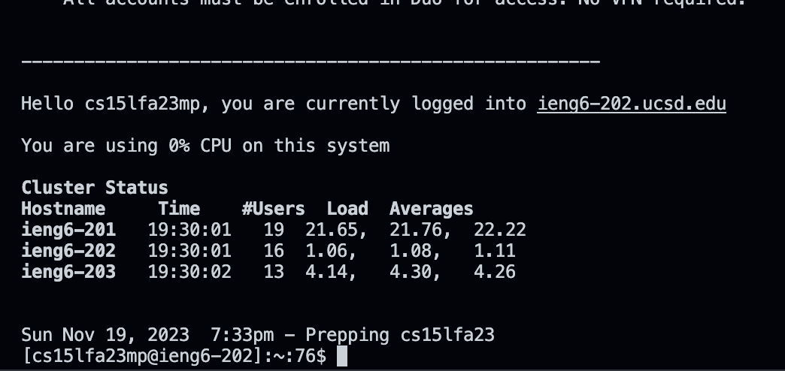
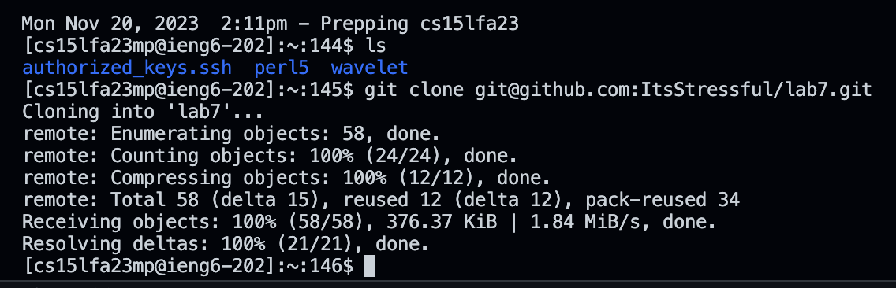

#Vim
**At the beginning I started at my home directory:**

**Then I logged in using the ssh using `<up><up><up><enter` in order to find it in my history:**

**Then I typed `Git clone` and followed with `/+v/`:**

