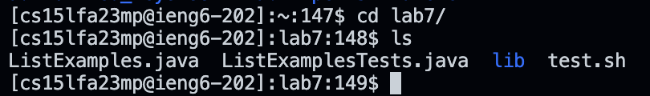
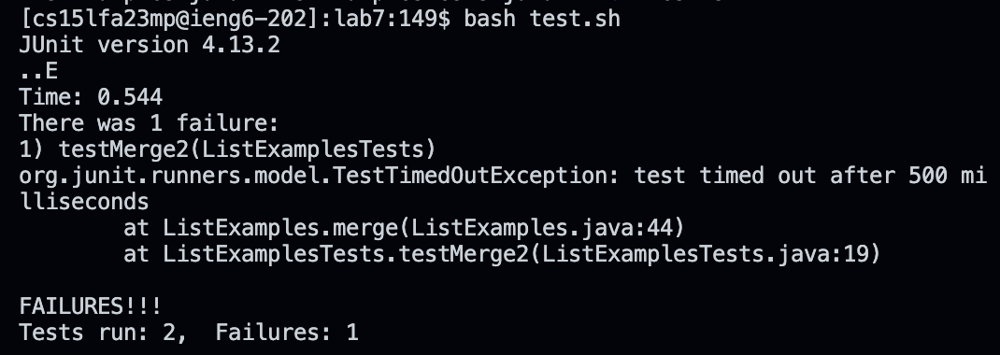
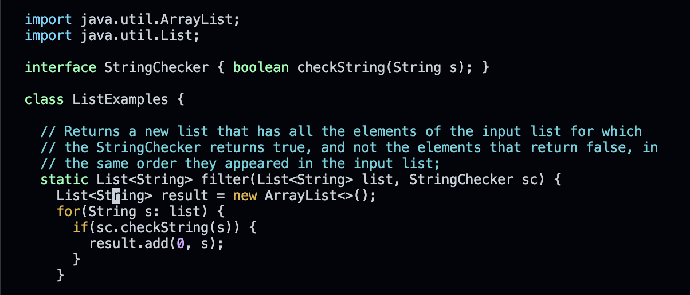
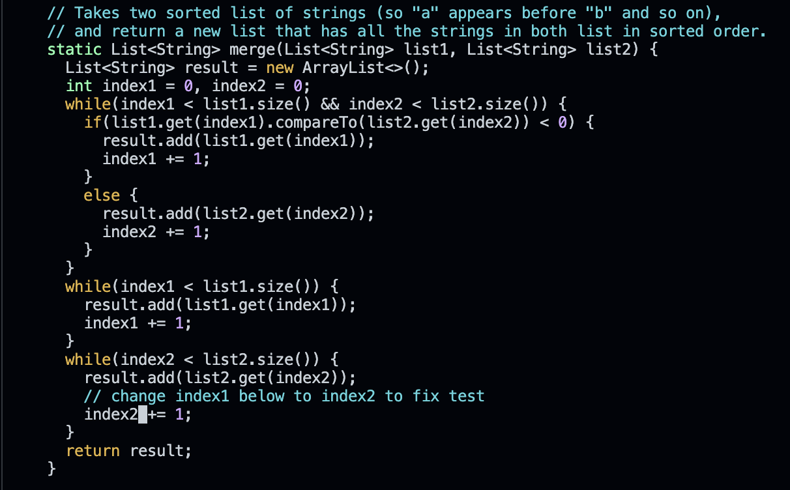
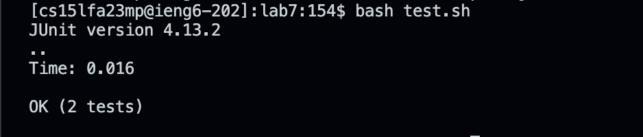
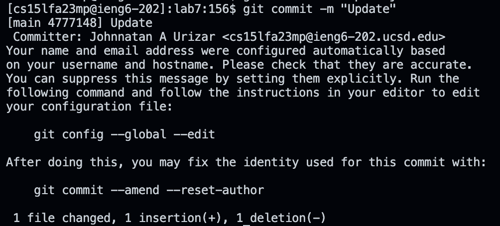
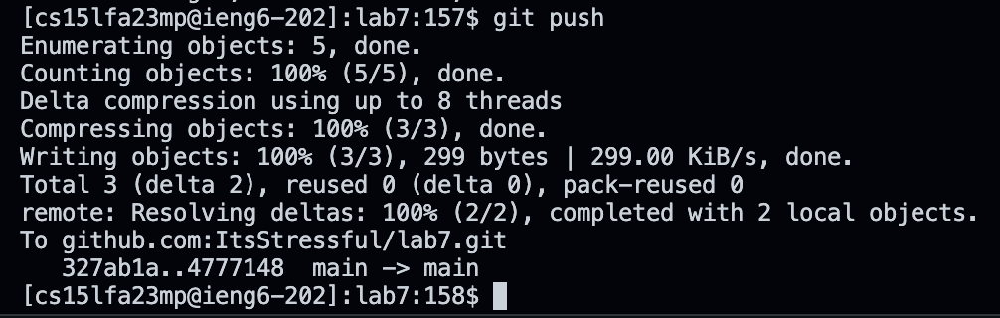

# Vim

## Step 1: Start
**At the beginning I started at my home directory:** 

*(Image of my home directory)*

## Step 2: Logging in Using SSH
**Then I logged in using SSH using `<up> <up> <up> <enter>` in order to find it in my search history (three away):**

*(Image of Login)*

## Step 3: Git Cloning
**Then I typed `Git clone` and followed with the paste command `/+v/` (the SSH link for lab 7 was saved in my clipboard) making a clone:**

*(Image of the Git clone command)*

## Step 4: Using Cd 
**Then I used `cd` then typed lab followed by`<tab>` (auto-filling it to lab7/)in order to change directories into lab7**

*(Image of me using cd)*

## Step 5: Running the Tests
**Then I used `bash test.sh` in order to see how the tests ran and noticed the tests had a failure**

*(Image of the failed test cases)*

## Step 6: Using Vim
**Then I typed `Vim ListExamples.java` in order to open the code on vim**

*(Image of the vim command and the vim page)*

## Step 7: Working in Command Mode
**While I was in Vim I checked to see what I needed to fix by scrolling using `<j>` in order to go down. After I located the need to change the code line that read** _index1 += 1_ **I proceeded to change it by hovering over the "1" (in "index1") then pressed `<x>` to delete the one then pressed `<i>` in order to enter insert mode where I would replace it will the correct number `<2>`. Finally, I made sure I exited insert mode by pressing `<esc>` followed by exiting and saving by typing `:wq` or rather `<:> <w> <q>`**

*(Image of the edited line)*

*(Image of the `:wq` command)*

## Step 8: Running the Newly Edited Code
**I pressed `<up> <up> <enter>` in order to locate the `Bash test.sh` that I used before and ran the tests again, in which they gave no test failures this time**

*(Image of the `Bash test.sh` working)*

## Step 9: Wrapping up
**Lastly, I typed out `git add ListExamples.java` in the terminal in order to commit the changes then I typed out `git commit -m "Update"` to give an update message. Then I typed out `git push` in order to push.

*(Image of the git add command)*

*(Image of the `git commit` message)*

*(Image of the git push command)*

