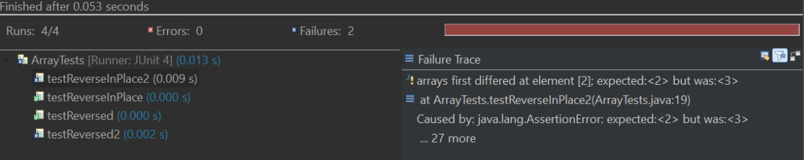
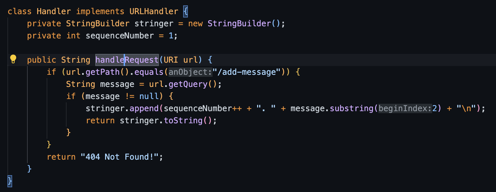
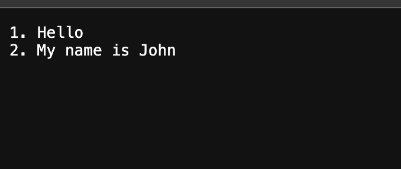
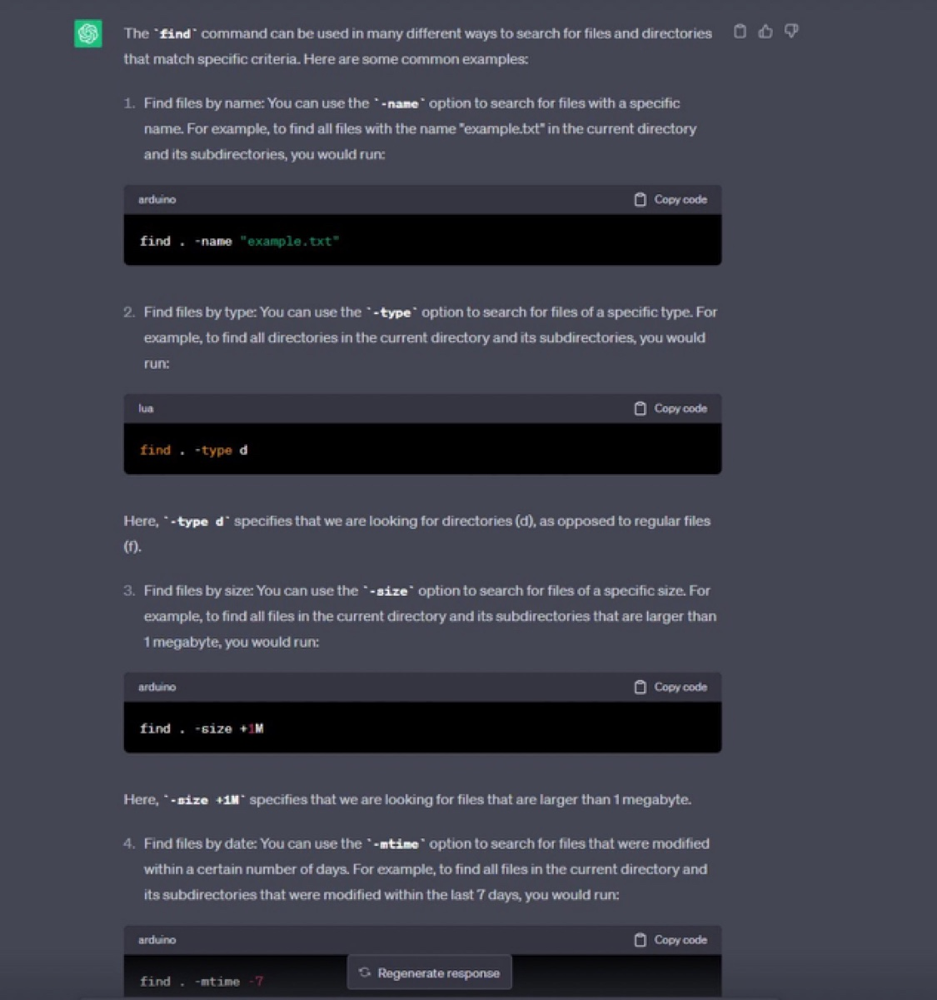

# Lab Report 3
## Bugs

Failed:
@Test
public void testReverseInPlace2(){
  int[] input={1,2,3,4};
  ArrayExamples.reverseInPlace(input);
  assertArrayEquals(new int[]{4,3,2,1}, input);
}

The expected output for the array was {4,3,2,1} but instead, it was changed to the array {4,3,3,4}.

Didn't Fail:
@Test
public void testReverseInPlace() {
  int[] input1 = { 3 };
  ArrayExamples.reverseInPlace(input1);
  assertArrayEquals(new int[]{ 3 }, input1);
}

The symptom:
Code before:

static void reverseInPlace(int[] arr) {
  for(int i = 0; i < arr.length; i += 1) {
  arr[i] = arr[arr.length - i - 1];
  }
}
Code after: 

static void reverseInPlace(int[] arr) {
  for(int i = 0; i < arr.length/2; i += 1) {
    int temp=arr[i];
    arr[i] = arr[arr.length - i - 1];
    arr[arr.length-i-1]=temp;
  }
}

The reason it wasn't working was that it wasn't being swapped but rather replaced. This is the reason it loses the value halfway through the array. The second reason was the for-loop traversed the entire list. Instead, you can grab the beginning of the array and then flip it to the other half.

## Part 1
I used the same methods from class that were used during the labs (add numbers URL one) and changed one of the methods to add strings together using StringBuilder and append. It will try to locate the term "/add-message" in the URL, if it doesn't find any strings after it will just return the "404 Not Found!" as an error message. If the /add-message is found in the URL with the strings following it will update "Stringer" by appending the words. Lastly, it will return Stringer as a response and appear on the page.

Next, I tested by using the example that was given to me in the lab report which was "/add-message?s=Hello" in which it printed the statement "Hello" correctly


\n

It checks the /add-message using the code line "if (url.getPath().equals("/add-message"))" then with the next line "String message = url.getQuery();" it will grab the message that you want to add. Then it will append the message onto "stringer" using this line "stringer.append(sequenceNumber++ + ". " + message.substring(2) + "\n");", then lastly it will return the string onto the page using this line "return stringer.toString()"




It will use the same code to run this as well.

## Part 2
Using ls on the command lines
I tried to run ssh on my computer multiple times and it didn't work and I even changed the password but still nothing.

## Part 3
I've learned how to create a server and display what I would want using my code. I also learned how to correctly use some of my skills from my other courses and apply my learnings in this course. I also know how to work the terminal in a wider scale in order to locate files and make sure I know my location at all times.

## Find files based on the time it was last modified

The command $ find technical -mtime [days] allows you to explore a designated directory and present a list of files and directories that have been modified within a specified time range. This functionality is advantageous as it enables you to search for both files and directories that were modified a precise number of days ago, within a defined range of days, or more than a certain number of days ago. You can achieve this by using the "+" or "-" symbols in your search criteria.


```
$ find technical -mtime -7
technical
technical/government
technical/.DS_Store
technical/plos/journal.pbio.0020010.txt
technical/911report
technical/911report/chapter-11.txt
```


The provided command is scanning the "technical" directory and compiling a list of files and directories that have undergone modifications in the previous 7 days. The use of the "-" sign before the number 7 specifies the search for files and directories modified within the specified number of days in the past.


```
$ find technical/plos -mtime +30
```


The displayed command is exploring the "technical/plos" directory in search of files and directories modified more than 30 days ago. The "+" symbol preceding the number 30 indicates the search for items altered more than the specified number of days in the past. The absence of output signifies that there are no files or directories in "technical/plos" that meet this criterion.

The command shown is searching through technical/plos to find files and directories that
have been modified greater than 30 days ago. The “+” in front of 30 is used to find files and
directories that have been modified greater than the specified number of days. No output was
produced, meaning that there are no files or directories in technical/plos that have been modified greater than 30 days ago.

*For each of the command shown, I used ChatGPT. Below is what I entered into ChatGPT, and the output that it produced*


