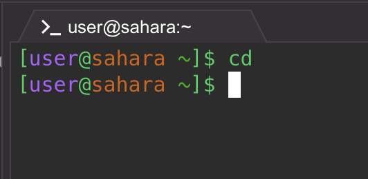

From starting the cd command with no arguments nothing appeared to pop-up because it didn't change the directory to any path.

Then using the command cd with a path to the directory it chanced the currect working directory to the given path (Lecture 1)

After using that command I ran cd using the file which chance the working directory to "messages"

